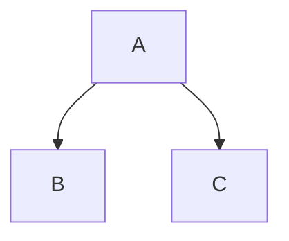
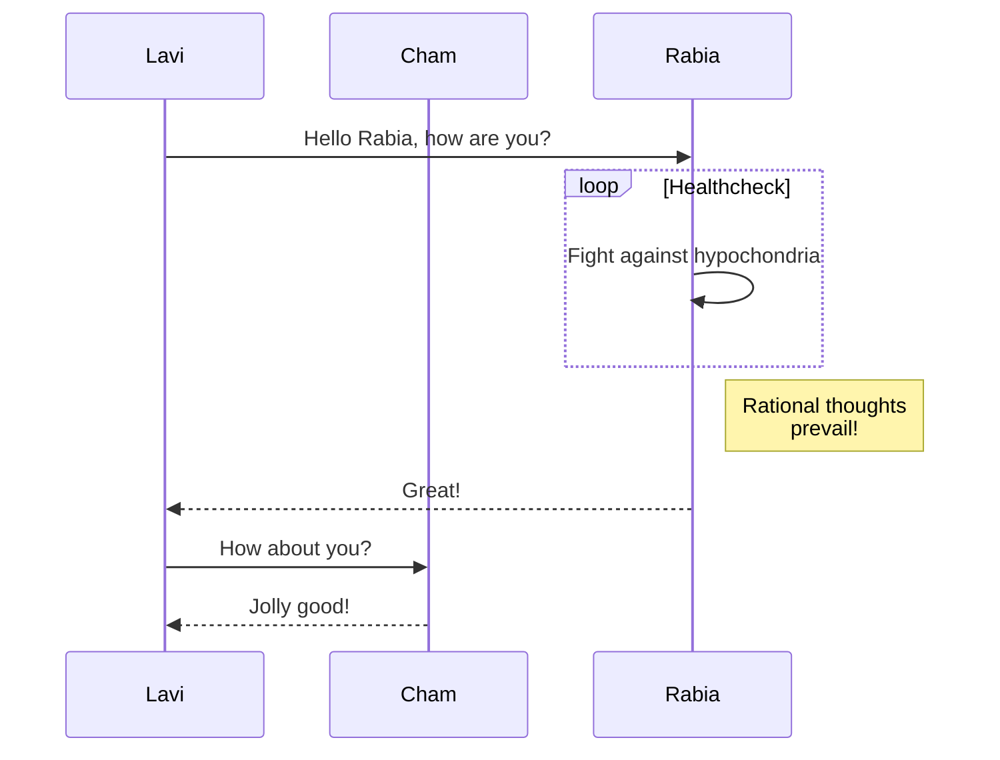

# Killer-whale-website

page about killer whales

will this save onto my vscode file?

anything

pls let me push

hello

```mermaid
graph TD;
  A-->B;
  A-->C;
```

```mermaid
sequenceDiagram
    participant Lavi
    participant Cham
    Lavi->>Rabia: Hello Rabia, how are you?
    loop Healthcheck
        Rabia->>Rabia: Fight against hypochondria
    end
    Note right of Rabia: Rational thoughts <br/>prevail!
    Rabia-->>Lavi: Great!
    Lavi->>Cham: How about you?
    Cham-->>Lavi: Jolly good!
```
